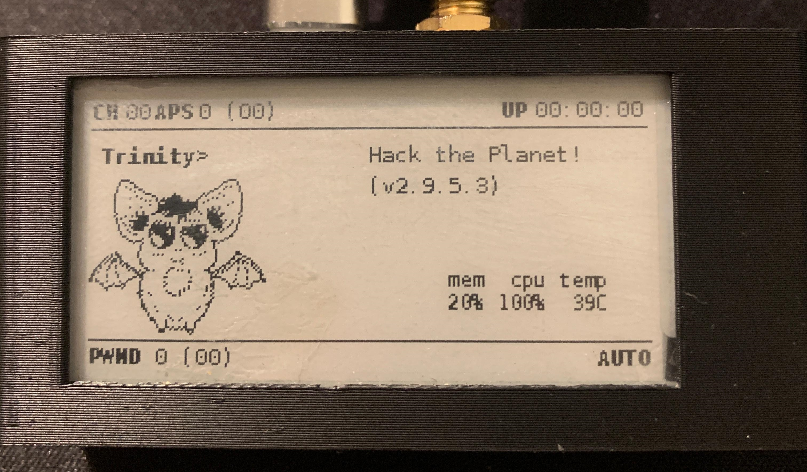
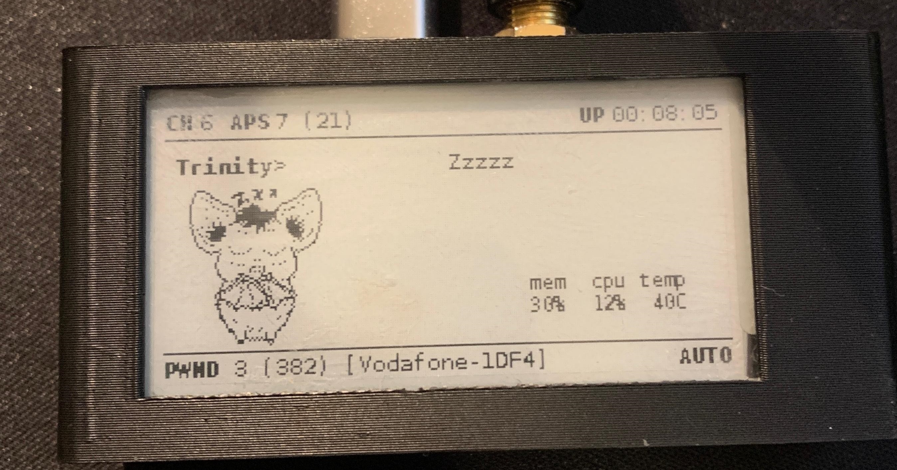

# 🦇 Trinity the Bat

**Trinity the Bat** is a custom face for the [Pwnagotchi](https://pwnagotchi.ai/).

This face is fully self-designed and hand-drawn, giving your Pwnagotchi a personal touch.

## Preview

  
  

## Requirements

To use this custom face, you will need a custom face mod like this one:

🔗 [PWNAGOTCHI-CUSTOM-FACES-MOD by roodriiigooo](https://github.com/roodriiigooo/PWNAGOTCHI-CUSTOM-FACES-MOD)

There's also a very helpful video tutorial explaining how to install and use the mod:

🎥 [YouTube Tutorial](https://www.youtube.com/watch?v=X-5jN0WjurQ)

---
## Voice
I made a custom voice.py for the Charakter too. 

If you managed to add the Face you will have no problem adding the Voice. 
Use FileZilla with Root access and enter /home/pi/.pwn/lib/python3.11/site-packages/pwnagotchi/voice.py
Replace the voice.py and voila!

Have fun! 

## Thank You!

This project has been cloned 20 times! I See This as an Absolute Win!
